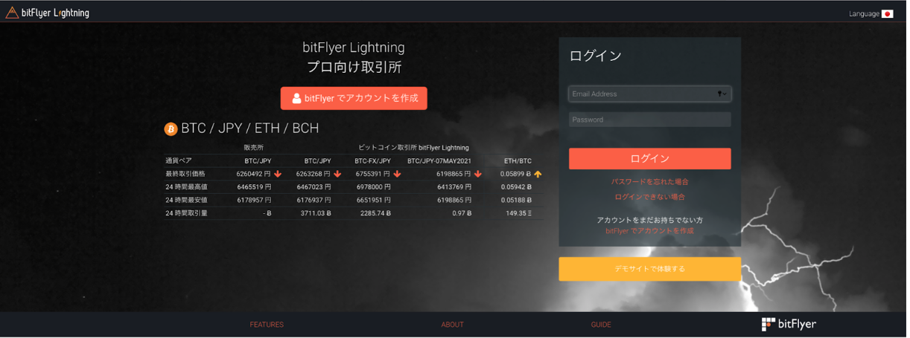
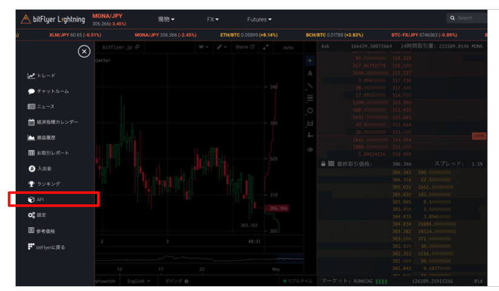
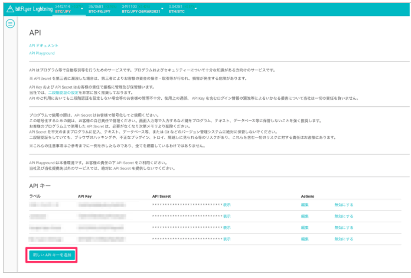
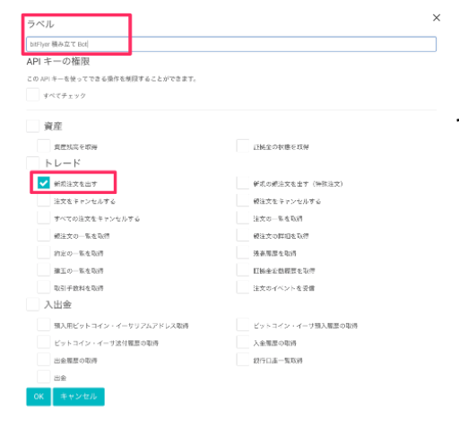
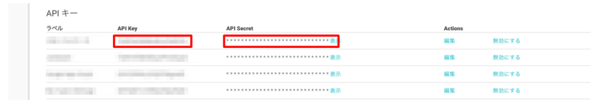

# bitFlyerのAPIキーを発行方法

## 1. 口座開設

#### 1-1. [bitFlyerアプリ](https://bitflyer.com/invitation?id=zqfsp2kh&lang=en-JP)をダウンロード

#### 1-2. アプリを開いて「アカウントの作成」を選択する

#### 1-3. メールアドレスを入力し、項目をチェックした後「アカウント作成」を選択する

#### 1-4. メールに記載されているURLをクリックする

#### 1-5. アカウント登録完了

## 2. 「ウォレットクラス」から「トレードクラス」にアップグレードする

#### 2-1. アプリのホーム画面からメニューを開く

#### 2-2. 「アカウント」を選択する

#### 2-3. マイアカウントから「登録内容」を選択する

#### 2-4. 「ご本人情報のご登録」から「お客様の取引目的等のご確認」までの登録を行う

#### 2-5. 「ご本人情報のご登録」を選択して、本人情報を入力する

#### 2-6. 「ご本人確認資料のご提出」を選択して、本人確認資料の写真をアップロードする

#### 2-7. 「お客様の取引目的等のご確認」から取引時確認事項を選択する

## 3． APIキーの発行

#### 3-1. [bitFlyerサイト](https://lightning.bitflyer.jp)にログインする

#### 3-1. 画面左の「API」をクリック

#### 3-2. 画面下の「新しいAPIキーを追加」をクリック

#### 3-3. 「新規注文を出す」を選択し、「OK」をクリック
- ラベルは任意の文字を入れてください。
- 「新規注文を出す」以外の選択を外すことをセキュリティの観点からおすすめしています。

#### 3-4. 「API Key」と「API Secret」をコピー
- 発行された「API Key」と「API Secret」をコピーし、積立申請フォームに入力してください。

## 参考サイト
 - [口座開設方法](https://news.mynavi.jp/cryptocurrency/bitflyer-account/)
 - [APIキー取得方法](https://support.me.moneyforward.com/hc/ja/articles/900003514806--bitFlyer-を連携する方法を教えてください)
 - [スライド](https://docs.google.com/presentation/d/1_2F0XdMI949wWQj3NVKL9ir4YIwHt12A6_JTJ4wUu7A/edit?usp=sharing
)

