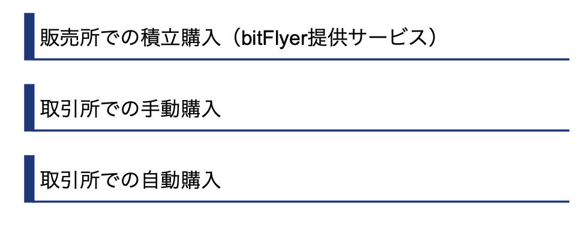
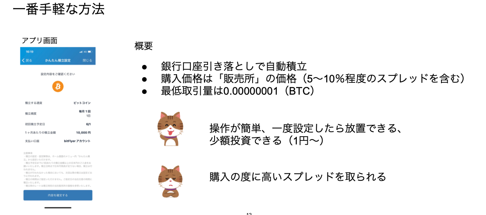
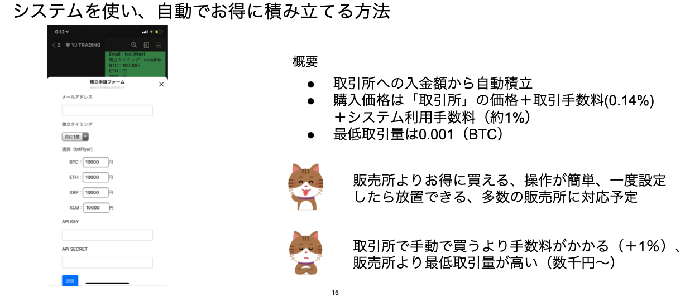
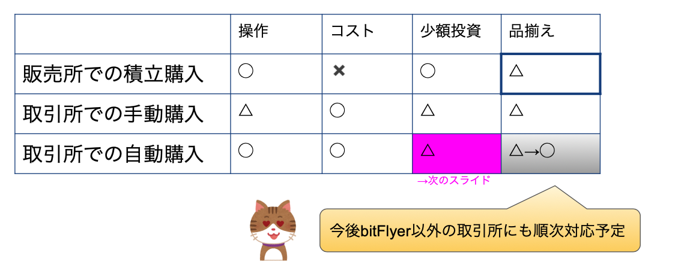
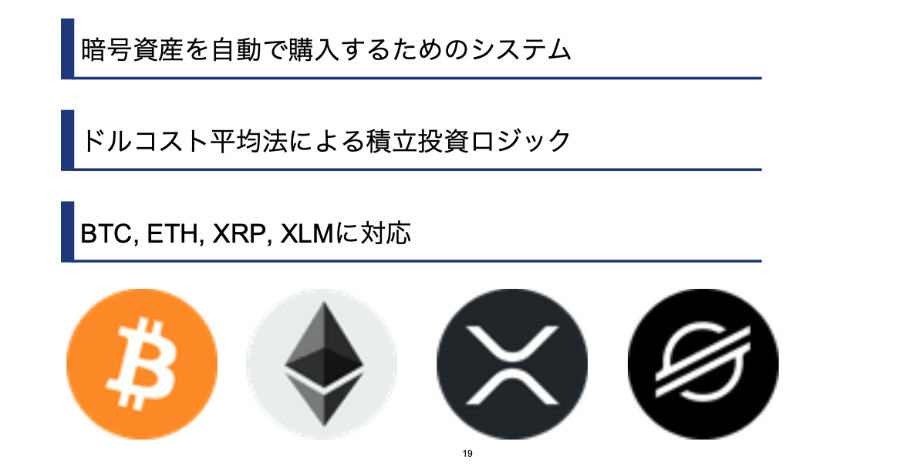
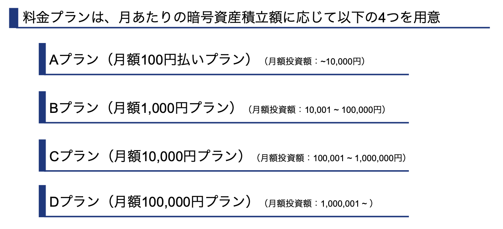
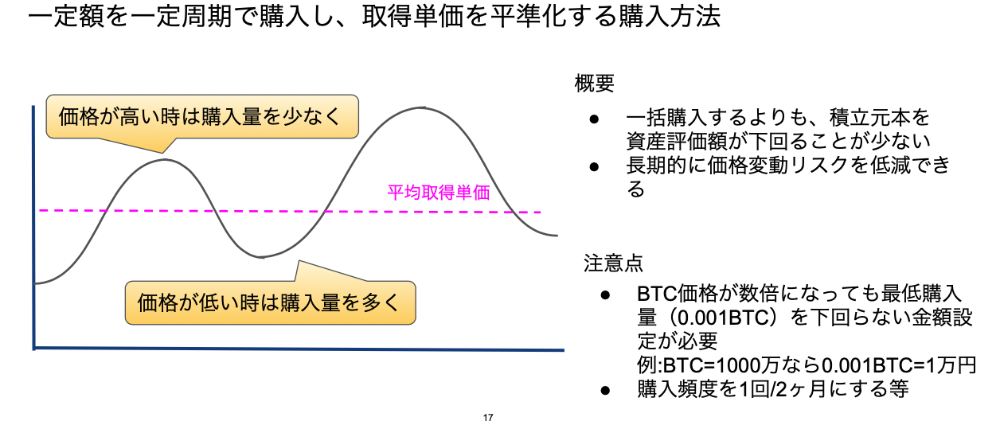

# 暗号資産自動積立システム 
YJ TRADINGが提供する「暗号資産自動積立システム」は、ドルコスト平均法による積立投資を自動で行うためのシステムのことです。

## 1. 暗号資産の購入方法 ~ 販売所と取引所とは？ ~

### 1-1. 暗号資産交換業者とは？
- 暗号資産の売買を行うことができる業者のこと

### 1-2. 販売所とは？
- 暗号資産交換業者とユーザーが直接取引を行う場所のこと

#### 1-2-1. 販売所の価格設定の仕組み

#### 1-2-2. 販売所の価格設定例
2021/5/19にXRPの市場価格119円だった（コインチェック）
ただし、XRPを買う時は142円、XRPを売る時には109円になってしまう
（購入時のスプレッドは約19%、売却時のスプレッドは約8％）

[動画リンク](https://www.youtube.com/watch?v=99hzT0RrZE0)

### 1-3. 取引所とは？
- ユーザー同士の取引をマッチングする場所のこと

#### 1-3-1. 取引所の価格設定の仕組み

## 2. 暗号資産を積み立てるには？

### 2-1. 積立方法には大きく３つの種類がある

### 2-2. 販売所での積立購入（bitFlyer提供サービス）

### 2-3. 取引所での手動積立

### 2-4. 取引所での自動積立

### 2-5. まとめ

### 3. YJ TRADING

### 3-1. YJ TRADINGの自動積立システムとは？

### 3-2. 料金プラン

### 4-1. ドルコスト平均法とは

### [スライド版](https://docs.google.com/presentation/d/1Olq-7pcgQjeyCzpd7w6y2rgKMqVwQzVXyDjqFrOoOGE/edit?usp=sharing)