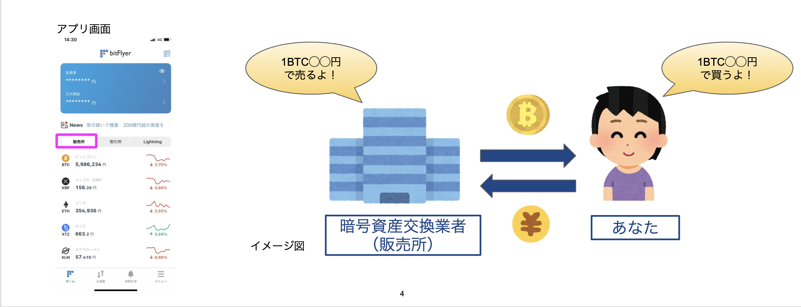

# YJ TRADINGの「暗号資産自動積立システム」

## 1. YJ TRADINGとは？
 - 暗号資産の自動投資、FXの自動売買を提供しているサービスです

### 1-1. 暗号資産の自動積立システム
- 

### 2-1. 暗号資産の購入方法
 - 現在、国内において暗号資産を購入する方法は以下の２つの方法がある
    - 販売所での購入
    - 取引所での購入 

### 2-2. 販売所と取引所の違いは？
- 販売所では、業者がユーザーに暗号資産を販売
- 取引所では、ユーザー同士が暗号資産の取引を行う

### 2-3. 販売所とは？
- 

### 2-4. 販売所の価格設定の仕組み
- 販売所では、市場価格に対して業者が設定したスプレッドを調整した金額で、ユーザーの購入価格と売却価格が決定される
    - 例) 以下の図は、2021/5/19時点のコインチェック販売所での実際のXRPの価格例
        - 市場価格が119.08円に対し、購入価格は142.84円、売却価格は109.68円となっていた
        - (購入時スプレッド：約19%、売却時スプレッド：約8%)
    - [実際の2021/5/19時点の動画](https://www.youtube.com/watch?v=99hzT0RrZE0)

### 2-5. 取引所の価格設定の仕組み
- 取引所では、ユーザーが購入希望価格・売却希望価格を決定

### 3-1. 暗号資産の積立方法
- 販売所での手動積立
- 販売所での自動積立(販売所が提供する積立サービス)
- 取引所での手動積立
- 取引所での自動積立

### 3-2. 積立方法比較
| | | メリット | デメリット | おすすめ度 |
| --- | --- | --- | --- | --- |
| 販売所 | 手動 | ・少額から積立可能 | ・手数料が高い（約10%）   ・自分で取引量を計算する必要がある   ・毎回操作する必要がある | 低
| 販売所 | 自動 | ・少額から積立可能   ・一度設定したらその後の操作不要   ・銀行引き落とし可能   ・業者が提供しているサービス ・チャートをみなくてよい| ・手数料が高い（約10%） | 低
| 取引所 | 手動 | ・手数料が安い（約0.1%） | ・操作が煩雑   ・最低取引額が高い   ・自分で取引量を計算する必要がある   ・毎回操作する必要がある | 中
| 取引所 | 自動 | ・手数料が安い（約1.1%）   ・一度設定したらその後の操作不要  ・銀行引き落とし可能   ・チャートをみなくてよい| ・最低取引額が高い | 高

### 3-3. YJ TRADINGの取引所での自動積立とは？
 - 取引所が公開しているAPIをYJ TRADINGが利用して自動積立を行う
 - YJ TRADINGの公式LINEから必要事項を申し込みするのみでOK

### 4-1. 料金プラン
- YJ TRADINGの料金プランは、月あたりの積立額に応じて以下の４つのプランを用意

### 5-1. その他（ドルコスト平均法とは）
- 

### [スライド版](https://docs.google.com/presentation/d/1Olq-7pcgQjeyCzpd7w6y2rgKMqVwQzVXyDjqFrOoOGE/edit?usp=sharing)